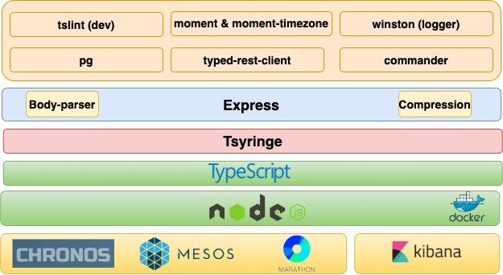

# Mail jobseeker extractor

The mail jobseeker extractor project can run in two modes: 

* **run**: this command is invoked by the chronos task and the aim is to insert, at the right moment, all the jobseeker ids that are selected to receive the mail jobseeker extractor mail, into the `jobseeker_mail_target` table.
* **serve**: it launches a web application useful to simulate response of both timezone and datastore microservices. 

For the **run** mode, the schedule frequency and the conditions used to select the jobseekers are set on Application Datastore:

**Schedule**: (one for each country)

* Period: time range (start - end). Ex. From 2020-01-01 to  2020-01-31 

* Interval: frequency (in calendar days) at which mails should be sent. Ex. if 7, a run is scheduled every week for the selected period. 

* Time: time (hh:mm) of the day when the mail sender configurator process should start.

* Query: key of the sql query chosen for this schedule. 

**Queries**: A list of pre-defined SQL queries. i.e. <query_key, sql (where conditions)>

The whole process could be summarized in these 3 steps:  

1. A chronos task is scheduled every 15 minutes in order to call the mail jobseeker extractor application. 

2. The mail jobseeker extractor fetches the schedule properties and checks if it is time to run.

3. When it is time to run, it selects the configured query (in order to extract the target jobseeker ids for the current run) and performs an insert into the `jobseeker_mail_target` table. 

The last run date is saved on `country_state` table in order to avoid unwanted multiple run. 

## Technologies / Architectures

**Technology Stack**



## Setting up a local copy

* Setup Database:

`docker run -it -p 5432:5432 --name zz_db -v ~/zz_db/:/var/lib/postgresql/data -e POSTGRES_PASSWORD=password -e POSTGRES_DB=zz_db -e POSTGRES_USER=zz_rw postgres:9.4`

* Run SQL scripts

`ddl.sql`

`sample-data.sql`

* Follow the below steps:

1. Clone `mail-jobseeker-extractor` github project
2. Setup environment: node (current version October/2020 is 12.19.0), npm (current version 6.14.8)
3. Install dependencies: `npm install`
4. Run the simulator: `./node_modules/.bin/ts-node ./src/main.ts serve`
5. To debug, set the env vars(`variables.env` file) and then start the `Mail Jobseeker Extractor` server defined in the `launch.json` in debug mode, passing `xx yy zz` as country parameters.

**variables.env**

```
DB_PASSWORD="password"
DB_HOST="localhost"
DATASTORE_API_URL="http://localhost:8000/api/v1/datastores/values"
TIMEZONE_SERVICE_API_URL="http://localhost:8000/api/v1/timezone/fullmap"
LOG_LEVEL="debug"
```

## Running the tests

`npm test`

## Build

`npm build`


## Deployment

**Deploy on Chronos** 

To deploy the Chronos app, we use the below command:  

`curl -vvv -L -H 'Content-Type: application/json' -X POST -d@chronos-env.json http://${CHRONOS_HOST}:4400/scheduler/iso8601`

Where `chronos-env.json` is the Chronos deployment descriptor file holding all the info needed for deployment in the Mesos environment, such as schedule frequency, docker container image, environment variables, the available resources’ info (CPUs, memory, etc) and the command to invoke (i.e.: `node main.js run -c ${DEPLOY_APP_COUNTRY}`) 

Since we have 58 countries and hence 58 Chronos tasks to deploy, we use a bash script (`chronos-deploy.sh`) to launch the command for all the countries. 

**Deploy on Marathon**

To deploy the microservices, the command is similar to the Chronos one: 

`curl -X PUT http://${MARATHON_HOST}:8080/${MARATHON_APP_ID} -d@marathon-env.json -H "Content-type: application/json"`

The `marathon-env.json` compared to the `chronos-env.json` has a little bit different syntax but the content is similar (i.e. the command to invoke, `node main.js serve`, must be specified). Since the deployed application, in this case, is a “long-running” application, the schedule frequency is not specified but other information such as the number of instances, service port, upgrade strategy, and health checks are required.  
